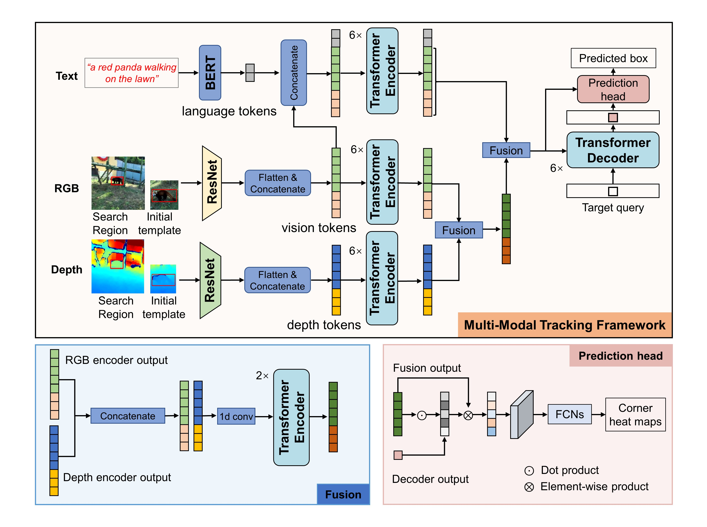

# UniMod1K：迈向更通用的大规模多模态学习数据集与基准

本仓库为论文 **UniMod1K: Towards a More Universal Large-Scale Dataset and Benchmark for Multi-Modal Learning** 中多模态（视觉 Vision、深度 Depth 与语言 Language）SPT 跟踪器的官方实现。

<center></center>

## 使用指南

### 1. 环境安装
使用 Anaconda 创建并配置环境：
```bash
conda create -n spt python=3.6
conda activate spt
bash install_pytorch17.sh
cd /path/to/UniMod1K/SPT
```
> 说明：`install_pytorch17.sh` 脚本应安装对应版本的 PyTorch、torchvision 等依赖。若您使用不同 CUDA 版本，可自行修改脚本或手动安装。

### 2. 数据准备
训练所用数据集为 **UniMod1K**。其目录结构示例：
```
--UniMod1K
    |--Adapter
        |--adapter1
        |--adapter2
        ...
    |--Animal
        |--alpaca1
        |--bear1
        ...
    ...
```
请将完整的 UniMod1K 数据集解压或组织成上述层级；类别（如 Adapter, Animal 等）下包含具体序列或样本。

### 3. 项目路径配置
运行以下命令生成本项目所需的本地路径配置文件：
```bash
python tracking/create_default_local_file.py --workspace_dir . --data_dir ./data --save_dir .
```
执行后，可通过编辑以下两个文件进一步修改路径：
```
lib/train/admin/local.py        # 训练相关路径
lib/test/evaluation/local.py    # 测试/评估相关路径
```

### 4. 预训练权重准备
1. 下载 BERT 预训练权重（[Google Drive 链接](https://drive.google.com/drive/folders/1Fi-4TSaIP4B_TPi2Jme2sxZRdH9l5NPN?usp=share_link)），放置于：
```
$PROJECT_ROOT$/pretrained_models/
```
在 `./experiments/spt/unimod1k.yaml` 中设置：
```
MODEL.LANGUAGE.PATH
MODEL.LANGUAGE.VOCAB_PATH
```
2. 下载 Stark-s 模型预训练权重（[Google Drive 链接](https://drive.google.com/drive/folders/142sMjoT5wT6CuRiFT5LLejgr7VLKmaC4)），同样放在：
```
$PROJECT_ROOT$/pretrained_models/
```
并在 `./experiments/spt/unimod1k.yaml` 中设置：
```
MODEL.PRETRAINED
```

### 5. 训练
多 GPU（DDP）训练示例（4 张 RTX 3090Ti，总 batch size = 16）：
```bash
export PYTHONPATH=/path/to/SPT:$PYTHONPATH
python -m torch.distributed.launch --nproc_per_node=4 ./lib/train/run_training.py
```
单 GPU 训练：
```bash
python ./lib/train/run_training.py
```
> 提示：若使用 PyTorch>=1.9，可考虑将 `torch.distributed.launch` 替换为 `torchrun`。

### 6. 测试
在运行测试前，编辑：
```
./lib/test/evaluation/local.py
```
设置测试集路径，然后执行：
```bash
python ./tracking/test.py
```
若希望直接使用预训练模型，可下载模型（[Google Drive 链接](https://drive.google.com/file/d/1aU1FWERBab0aGR9nxwN138JG1lLQlnU5/view?usp=drive_link)），并在：
```
./lib/test/parameter/spt.py
```
中设置其路径。

### 7. 评估
将原始跟踪结果放入 [VOT Toolkit](https://github.com/votchallenge/toolkit) 的工作空间目录，之后使用 VOT Toolkit 的分析命令进行评估。VOT Toolkit 的使用教程可参考其官方文档：[HowTo Overview](https://www.votchallenge.net/howto/overview.html)。

## 文件/配置速览
- 主要实验配置：`./experiments/spt/unimod1k.yaml`
- 多模态模型代码：`./lib/models/spt/`
- 训练脚本：`./lib/train/run_training.py`
- 测试入口：`./tracking/test.py`

## 常见问题 (FAQ)
1. Python 版本可以升级吗？
   - 项目当前示例使用 Python 3.6；若需升级到 3.8/3.9，需确认依赖（特别是某些编译包）兼容性，并重新安装 PyTorch。
2. 分布式训练卡住？
   - 检查 `MASTER_PORT` 是否被占用，或添加参数 `--master_port=<FREE_PORT>`。
3. 日志位置在哪里？
   - 默认保存于运行时指定的 `save_dir`；可在配置文件或脚本中自定义。TensorBoard 支持参见 `lib/train/admin/tensorboard.py`。

## 致谢
- 本项目基于优秀工作 [Stark](https://github.com/researchmm/Stark)。感谢其开源贡献。

## 联系方式
如有问题或合作意向，请邮件联系：`xuefeng_zhu95@163.com`
（可在邮件标题中注明 “UniMod1K-SPT” 以便快速识别）

## 许可证
详见仓库中的 `LICENSE` 文件。

## English Version
For the English README, please refer to `README.md` in the project root.
